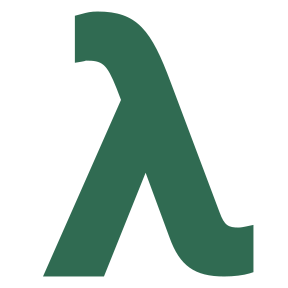

# laurelang

A pure logical, compact language.

Work in progress.

# Usage

Laurelang stands for Logic, Abstraction and Unification with Readability and Efficience.

Language aims to become reasonable choice for declarative, logic, constraint programming research, performant for quering and reasoning in big data.

```
: ?prime(natural).

?prime(1).
?prime(2).
?prime(n) {
    n > 2; n?;
    b = between(1, n);
    &all b {
        n / b ->
            fail();
    };
}
```

# Getting started

## Build from source

Clone the repository and run auto-builder:

```
git clone https://github.com/timoniq/laurelang.git
cd laurelang
make auto
```

Auto-builder will also run test suite.

# Documentation

[Read documentation](https://docs.laurelang.org)  
[Current updates and notes](/docs/index.md)

# [Contributing](/contributing.md)
# License

Laurelang is [MIT licensed](/LICENSE)  
Copyright © 2022 [timoniq](https://github.com/timoniq)